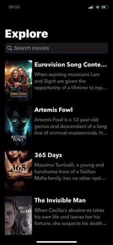
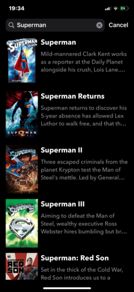

# TVShows
Test task for geniusee. Using 3rd party libraries is prohibited. 
App for searching movies by keyword using The Movie Database API

## Installation
* Download zip
* Open project using xcodeproj file

## Demo

   

## Features
* URLSession networking
* Dark theme support
* Self-explaining and clean code (at least I tried :) ), comments in important places
* Markdown documentation in public methods in API
* Code formatted

## About

My name is Vlad, iOS developer based in Kyiv. Feel free to contact me for hiring or collabration. Contact email: vladyslavkolomiets@gmail.com
